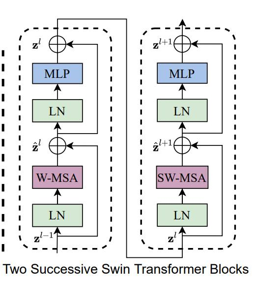
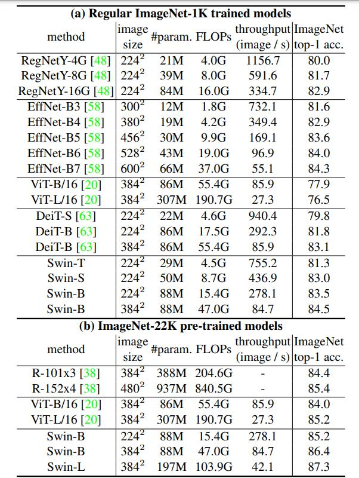

# Swin Trasnformer

## 1. 模型介绍
Swin Transformer是由微软亚洲研究院在今年公布的一篇利用transformer架构处理计算机视觉任务的论文。Swin Transformer 在图像分类，图像分割，目标检测等各个领域已经屠榜，在论文中，作者分析表明，Transformer从NLP迁移到CV上没有大放异彩主要有两点原因：1. 两个领域涉及的scale不同，NLP的scale是标准固定的，而CV的scale变化范围非常大。2. CV比起NLP需要更大的分辨率，而且CV中使用Transformer的计算复杂度是图像尺度的平方，这会导致计算量过于庞大。为了解决这两个问题，Swin Transformer相比之前的ViT做了两个改进：1.引入CNN中常用的层次化构建方式构建层次化Transformer 2.引入locality思想，对无重合的window区域内进行self-attention计算。另外，Swin Transformer可以作为图像分类、目标检测和语义分割等任务的通用骨干网络，可以说，Swin Transformer可能是CNN的完美替代方案。

## 2. 模型结构
下图为Swin Transformer与ViT在处理图片方式上的对比，可以看出，Swin Transformer有着ResNet一样的残差结构和CNN具有的多尺度图片结构。


下图为Swin Transformer的网络结构，输入的图像先经过一层卷积进行patch映射，将图像先分割成4 × 4的小块，图片是224×224输入，那么就是56个path块，如果是384×384的尺寸，则是96个path块。这里以224 × 224的输入为例，输入图像经过这一步操作，每个patch的特征维度为4x4x3=48的特征图。因此，输入的图像变成了H/4×W/4×48的特征图。然后，特征图开始输入到stage1，stage1中linear embedding将path特征维度变成C，因此变成了H/4×W/4×C。然后送入Swin Transformer Block，在进入stage2前，接下来先通过Patch Merging操作，Patch Merging和CNN中stride=2的1×1卷积十分相似，Patch Merging在每个Stage开始前做降采样，用于缩小分辨率，调整通道数，当H/4×W/4×C的特征图输送到Patch Merging，将输入按照2x2的相邻patches合并，这样子patch块的数量就变成了H/8 x W/8，特征维度就变成了4C，之后经过一个MLP，将特征维度降为2C。因此变为H/8×W/8×2C。接下来的stage就是重复上面的过程。


Swin Transformer中重要的当然是Swin Transformer Block了，下面解释一下Swin Transformer Block的原理。
先看一下MLP和LN，MLP和LN为多层感知机和相对于BatchNorm的LayerNorm。原理较为简单，因此直接看paddle代码即可。

```python
class Mlp(nn.Layer):
    def __init__(self, in_features, hidden_features=None, out_features=None, act_layer=nn.GELU, drop=0.):
        super().__init__()
        out_features = out_features or in_features
        hidden_features = hidden_features or in_features
        self.fc1 = nn.Linear(in_features, hidden_features)
        self.act = act_layer()
        self.fc2 = nn.Linear(hidden_features, out_features)
        self.drop = nn.Dropout(drop)

    def forward(self, x):
        x = self.fc1(x)
        x = self.act(x)
        x = self.drop(x)
        x = self.fc2(x)
        x = self.drop(x)
        return x
```
[Layer Norm paddle API](https://www.paddlepaddle.org.cn/documentation/docs/zh/api/paddle/nn/LayerNorm_cn.html#layernorm)

下图就是Shifted Window based MSA是Swin Transformer的核心部分。Shifted Window based MSA包括了两部分，一个是W-MSA（窗口多头注意力），另一个就是SW-MSA（移位窗口多头自注意力）。这两个是一同出现的。



一开始，Swin Transformer 将一张图片分割为4份，也叫4个Window，然后独立地计算每一部分的MSA。由于每一个Window都是独立的，缺少了信息之间的交流，因此作者又提出了SW-MSA的算法，即采用规则的移动窗口的方法。通过不同窗口的交互，来达到特征的信息交流。


## 3. 模型实现
Swin Transformer涉及模型代码较多，所以建议完整的看Swin Transformer的代码，因此推荐一下桨的[Swin Transformer](https://github.com/PaddlePaddle/PaddleClas/blob/release/2.2/ppcls/arch/backbone/model_zoo/swin_transformer.py)实现。

## 4. 模型特点
1. 首次在cv领域的transformer模型中采用了分层结构。
2. 在多层结构中采用不同尺度的特征处理方法以获取具有更深语义信息的特征。
3. 引入locality思想，对无重合的window区域内进行self-attention计算。

## 5. 模型效果


图中不同配置的Swin Transformer解释如下。


C就是上面提到的类似于通道数的值，layer numbers就是Swin Transformer Block的数量了。这两个都是值越大，效果越好。和ResNet十分相似。

下图为COCO数据集上目标检测与实例分割的表现。都是相同网络在不同骨干网络下的对比。


下图为语义分割数据集ADE20K上的表现。


可以看到，Swin Transformer 都取得了十分优异的成绩。

## 6. 参考文献
[Swin Transformer](https://arxiv.org/pdf/2103.14030.pdf)


```python

```
