# 对抗生成网络（GANs）综述

## 1、生成模型

​		所谓生成模型，就是指可以描述成一个生成数据的模型，属于一种概率模型。维基百科上对其的定义是：在概率统计理论中, **生成模型**是指能够随机生成观测数据的模型，尤其是在给定某些隐含参数的条件下。它给观测值和标注数据序列指定一个[联合概率分布](https://zh.wikipedia.org/wiki/联合概率分布)。在机器学习中，生成模型可以用来直接对数据建模（例如根据某个变量的概率密度函数进行数据采样），也可以用来建立变量间的[条件概率分布](https://zh.wikipedia.org/wiki/条件概率分布)。条件概率分布可以由生成模型根据[贝叶斯定理](https://zh.wikipedia.org/wiki/贝叶斯定理)形成。通俗的说，通过这个模型我们可以生成不包含在训练数据集中的新的数据。如**图1**所示，比如我们有很多马的图片通过生成模型学习这些马的图像，从中学习到马的样子，生成模型就可以生成看起来很真实的马的图像并却这个图像是不属于训练图像的。

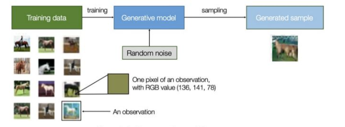

图1 生成模型处理流程图
  

​		而我们常见的模型，一般属于判别模型。如**图2**所示，判别模型可以简单的理解为分类。例如把一副图像分成猫或者狗或者其他，像**图2**中我们训练一个判别模型去辨别是否是梵高的画，这个判别模型会对数据集中的画的特征进行提起和分类，从而区分出哪个是梵高大师所作。

​		因此，生成模型与判别模型的区别在于：

1. 生成模型的数据集是没有和判别模型类似的标签的（即标记信息，生成模型也是可以有标签的，生成模型可以根据标签去生成相应类别的图像）,生成模型像是一种非监督学习，而判别模型是一种监督学习。

2. 数学表示：

   判别模型： p(y|x) 即给定观测x得到y的概率。

   生成模型：p(x) 即观测x出现的概率。如果有标签则表示为: p(x|y) 指定标签y生成x的概率。

		

图2 判别模型处理流程图
  

​		而GAN模型的诞生，就是结合了生成模型的特点与判别模型的特点，通过动态对抗的方式进行训练，在同态平衡中寻找最优解。 

## 2、什么是GAN？

### 2.1 对抗思想

​	GAN的主要思想是对抗思想：对抗思想已经成功地应用于许多领域，如机器学习、人工智能、计算机视觉和自然语言处理。最近AlphaGo击败世界顶尖人类玩家的事件引起了公众对人工智能的兴趣。AlphaGo的中间版本使用两个相互竞争的网络。对抗性示例是指与真实示例非常不同，但被非常自信地归入真实类别的示例，或与真实示例略有不同，但被归入错误类别的示例。这是最近一个非常热门的研究课题。

​	对抗式机器学习是一个极大极小问题。defender构建了我们想要正确工作的分类器，他在参数空间中搜索，以找到尽可能降低分类器成本的参数。同时，攻击者正在搜索模型的输入以使成本最大化。对抗性思想存在于对抗性网络、对抗性学习和对抗性示例中。

​	对抗思想的理论背景是博弈论。博弈论，又称为对策论（Game Theory）、赛局理论等，既是现代数学的一个新分支，也是运筹学的一个重要学科。博弈论主要研究公式化了的激励结构间的相互作用，是研究具有斗争或竞争性质现象的数学理论和方法。博弈论考虑游戏中的个体的预测行为和实际行为，并研究它们的优化策略。生物学家使用博弈理论来理解和预测进化论的某些结果。[（博弈论及其相关概念）](https://paddlepedia.readthedocs.io/en/latest/tutorials/generative_adversarial_network/basic_concept/Game%20theory.html)

### 2.2 GAN	

​		GAN如其名，是一个生成与对抗并存的神经网络。一般一个GAN网络包括了一个生成器（Generator）和一个判别器（Discriminator）。生成器用来根据要求不断生成越来越接近实际标签的数据，判别器用来不断区分生成器的生成结果和实际标签的区别。例如对于图像超分辨率问题来说，一般神经网络使用损失函数从不同角度（例如像素、特征图等）监督生成图像与真实标签之间的区别，通过优化寻找损失函数的最小值所对应的模型参数。一个GAN网络模型则会通过生成器生成图像，再通过判别器动态的判别生成图像与真实图像的区别。如下图所示，为了具有对比性，左眼展示的是图像原本样子，右眼是通过GAN网络后的样子。很明显， GAN网络将原本模糊的图像变得更加清晰，细节纹理表现的更加突出了。

图3 用于图像超分的GAN模型效果示例
  

​	当然，GAN网络也不仅仅用于图像超分任务中，图像转换，图像理解，图像填补等任务都可以使用GAN。

​	生成算法和判别算法是两类机器学习算法。如果机器学习算法基于观测数据的完全概率模型，则该算法是生成的。生成算法由于其广泛的实际应用而变得越来越流行和重要。

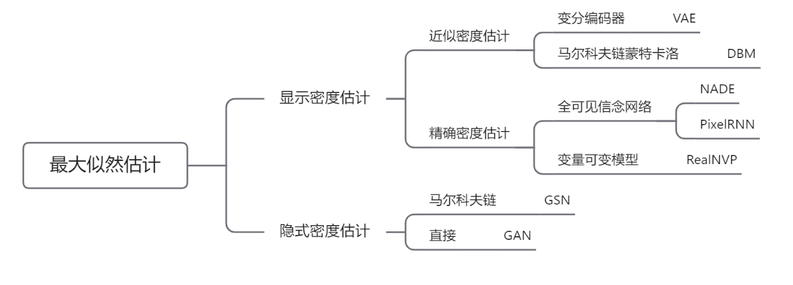

图4 生成算法树状图
  

​		生成算法可分为两类：显式密度模型和隐式密度模型。

​		显式密度模型假设分布，并利用真实数据训练包含分布的模型或拟合分布参数。完成后，利用学习的模型或分布生成新的示例。显式密度模型包括最大似然估计（MLE）、近似推理、和马尔可夫链方法。这些显式密度模型具有显式分布，但也有局限性。例如，对真实数据进行最大似然估计，并根据真实数据直接更新参数，这会导致生成的模型过于平滑。由于目标函数求解困难，用近似推理学习的生成模型只能逼近目标函数的下界，而不能直接逼近目标函数。马尔可夫链算法可以用来训练生成模型，但计算量大。此外，显式密度模型存在计算可处理性问题。它可能无法表示真实数据分布的复杂性，也无法了解高维数据分布。

​		隐式密度模型不能直接估计或拟合数据分布。它从分布中生成数据实例，没有明确的假设，并利用生成的实例修改模型。在GANs之前，隐式密度模型通常需要利用祖先抽样或基于马尔可夫链的抽样进行训练，这是低效的，并限制了其实际应用。GAN属于有向隐式密度模型范畴。

​		GANs属于生成算法,和其他生成算法相比，GANs的提出是为了克服其他生成算法的缺点。对抗式学习背后的基本思想是，生成器试图创建尽可能真实的示例来欺骗鉴别器。鉴别器试图区分假例子和真例子。生成器和鉴别器都通过对抗式学习进行改进。这种对抗性的过程使GANs比其他生成算法具有显著的优势。更具体地说，GANs比其他生成算法具有以下优势：

- GANs可以并行生成，这对于其他生成算法是不可能的
- 生成器的设计没有限制。
- 人们主观上认为GANs比其他方法能产生更好的例子。

​		下图是一个经典的GAN网络模型。我们先来理解下GAN的两个模型要做什么。首先是判别模型，就是图中右半部分的网络，图中Discriminator部分就是上文到的判别模型，一般使用常见的神经网络结构如VGG、ResNet等作为结构主体。输入一副图像（如$X_{real},X_{fake}$），输出一个概率值，用于判断真假使用（概率值大于0.5为真，小于0.5为假），但真假也不过是人们定义的概率而已。其次是生成模型(Generator部分)，生成模型同样也是由经典网络模型为基础构建的，针对不同问题进行卷积层、池化层等的增删修改。Generator的输入为一组随机数Z，输出一个图像。从图中可以看到存在两个数据集，一个是真实数据集，另一个是假的数据集，这个数据集就是有生成网络造出来的数据集。根据这个图我们再来理解一下GAN的目标：

- 判别网络的目的：能判别出来属于的一张图它是来自真实样本集还是假样本集。假如输入的是真样本，网络输出就接近1，输入的是假样本，网络输出接近0，这就达到了很好判别的目的。

- 生成网络的目的：生成网络是制作样本的，它的目的就是使得自己制作样本的能力尽可能强，能够达到判别网络没法判断该样本是真样本还是假样本。

​		GAN网络主要由生成网络与鉴别网络两个部分，隐变量$ z $ （通常为服从高斯分布的随机噪声）通过Generator生成$ X_{fake} $  , 判别器负责判别输入的data是生成的样本$ X_{fake} $   还是真实样本$ X_{real} $  。

图5 GAN模型结构示意图
  

 [loss](https://paddlepedia.readthedocs.io/en/latest/tutorials/generative_adversarial_network/basic_concept/GAN%20loss.html)如下：

$$
{\min _G}{\max _D}V(D,G) = {\min _G}{\max _D}{E_{x \sim {p_{data}}(x)}}[\log D(x)] + {E_{z \sim {p_z}(z)}}[\log (1 - D(G(z)))]
$$

​		对于判别器D来说，这是一个二分类问题，V(D,G)为二分类问题中常见的交叉熵损失。对于生成器G来说，为了尽可能欺骗D，所以需要最大化生成样本的判别概率D(G(z))，即最小化 $ \log (1 - D(G(z))) $ (注意：$ \log D(x) $  一项与生成器G无关，所以可以忽略。)

​		实际训练时，生成器和判别器采取交替训练，即先训练D，然后训练G，不断往复。值得注意的是，对于生成器，其最小化的是$ {\max _D}V(D,G) $ ，即最小化$  V(D,G)$的最大值。为了保证V(D,G)取得最大值，所以我们通常会训练迭代k次判别器，然后再迭代1次生成器（不过在实践当中发现，k通常取1即可）。当生成器G固定时，我们可以对V(D,G)求导，求出最优判别器 $ {D^ * }(x) $:

$$
{D^ * }(x) = \frac{{{p_{data}}(x)}}{{{p_g}(x) + {p_{data}}(x)}}
$$

​		把最优判别器代入上述目标函数，可以进一步求出在最优判别器下，生成器的目标函数等价于优化$ {p_{data}}(x),{p_g}(x) $ 的JS散度(JSD, Jenson Shannon Divergence)。可以证明，当G，D二者的capacity足够时，模型会收敛，二者将达到纳什均衡。此时，$ {p_{data}}(x) = {p_g}(x) $  ，判别器不论是对于$ {p_{data}}(x) $  还是$ {p_g}(x) $  中采样的样本，其预测概率均为$ \frac{1}{2} $  ，即生成样本与真实样本达到了难以区分的地步。

## 3、GAN的发展脉络

​		伴随着信息技术的革新、硬件设备算力的不断更替，人工智能在信息化社会蓬勃发展，以生成模型为代表的机器学习领域，持续受到研究者关注。它被广泛应用于计算机视觉领域，如图像生成、视频生成等任务；以信息隐写 、文本生成等任务为代表的自然语言处理方向；音频领域的语音合成等方向，并且在这些任务中，生成模型均表现出了惊人的效果。目前，GAN在计算机视觉、医学、自然语言处理等领域的研究一直保持着活跃状态。此外，生成对抗网络模型的研究工作主要集中在以下两个方面：一是聚焦于理论线索尝试提高生成对抗网络的稳定性和解决它的训练问题，或考虑不同的角度（如信息论、模型效率等方面）丰富其结构；二是专注于生成对抗网络在不同应用领域内的变体结构和应用场景 。除了图像合成，生成对抗网络还在其他方向成功应用，如图像的超分辨率  、图像描述 、图像修复 、文本到图像的翻译 、语义分割 、目标检测 、生成性对抗攻击 、机器翻译 、图像融合及去噪 。

​		2014年，Ian GoodFellow提出了GAN模型。自GAN提出起，生成对抗网络迅速成为了最火的生成式模型。在快速发展的青春期，GAN产生了许多流行的架构，如DCGAN，StyleGAN，BigGAN，StackGAN，Pix2pix，Age-cGAN，CycleGAN等。这个是生成对抗网络家族图。左边部分主要是改进模型解决实际的图片转换，文本转图像，生成图片，视频转换等实际问题；右边部分则是主要解决GAN框架本身存在的一些问题。传统的生成模型最早要追溯到80年代的RBM，以及后来逐渐使用深度神经网络进行包装的AutoEncoder。然后就是现在称得上最火的生成模型GAN。

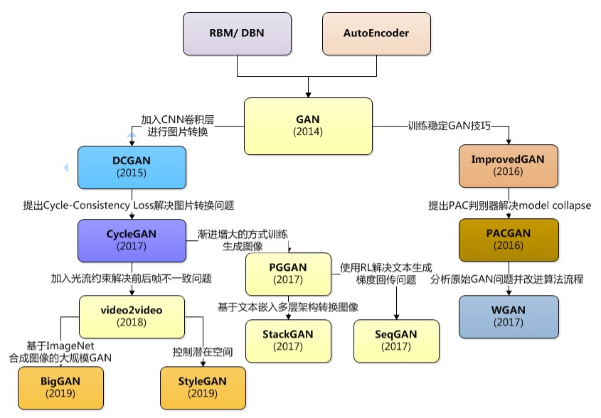

图6 经典GAN模型发展示意图
  

## 4、经典GAN模型介绍

表1 不同种类GANs分类情况
  

**表1**是基于算法的GANs方法的整理，从GANs训练策略、结构变化、训练技巧、监督类型等方面对现有GAN方法进行了分类。本文选取经典模型与方法进行说明。

### 	4.1 GAN的代表性变体

#### 4.1.1 InfoGAN

​		它的原理很简单，在info GAN里面，把输入向量z分成两部分，c 和 z'。c可以理解为可解释的隐变量，而z可以理解为不可压缩的噪声。希望通过约束c与output的关系，使得c的维度对应output的语义特征，以手写数字为例，比如笔画粗细，倾斜度等。为了引入c，作者通过互信息的方式来对c进行约束，也可以理解成自编码的过程。具体的操作是，generator的output，经过一个分类器，看是否能够得到c。其实可以看成一个anto-encoder的反过程。其余的discriminator与常规的GAN是一样的。

图7 InfoGAN结构示意图
  

​		在实际过程中，classifier和discriminator会共享参数，只有最后一层是不一样的，classifier输出的是一个vector, discriminator输出的是一个标量。

从损失函数的角度来看，infoGAN的损失函数变为：
$$
{\min _G}{\max _D}{V_I}(D,G) = V(D,G) - \lambda I(c;G(z,c))
$$
​		相比起原始的GAN，多了一项 $ \lambda I(c;G(z,c)) $,这一项代表的就是c与generator的output的互信息。这一项越大，表示c与output越相关。

为什么info GAN是有效的？直观的理解就是，如果c的每一个维度对Output都有明确的影响，那么classifier就可以根据x返回原来的c。如果c对output没有明显的影响，那么classifier就无法返回原来的c。下面是info GAN的结果。改变categorical变量可以生成不同的数字，改变continuous变量可以改变倾斜度和笔画粗细。

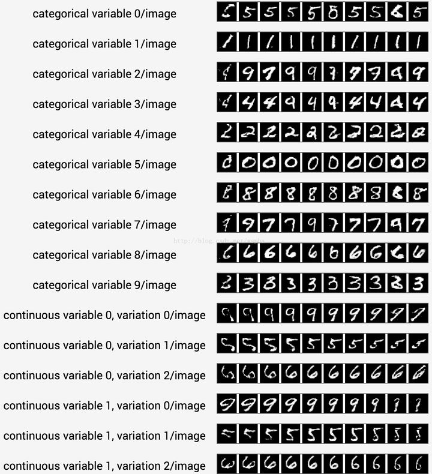

图8 InfoGAN结果
  

#### 4.1.2 Conditional GANs (cGANs)

​		如果鉴别器和生成器都依赖于一些额外的信息，则GANs可以扩展为一个条件模型。条件GANs的目标函数是：

$$
{\min _G}{\max _D}V(D,G) = {E_{x \sim {p_{data}}(x)}}[\log D(x|y)] + {E_{z \sim {p_z}(z)}}[\log (1 - D(G(z|y)))]
$$

​		我们可以看到InfoGAN的生成器与CGAN的生成器相似。然而，InfoGAN的潜在编码是未知的，它是通过训练发现的。此外，InfoGAN还有一个额外的网络Qto输出条件变量$ Q(c|x) $。

​		基于CGAN，我们可以在类标签、文本、边界框和关键点上生成样本条件。使用堆叠生成对抗网络（SGAN）进行文本到照片真实感图像合成。CGAN已用于卷积人脸生成、人脸老化、图像转换、合成具有特定景物属性的户外图像、自然图像描述和3D感知场景操作。Chrysos等人提出了稳健的CGAN。Kumparampil等人讨论了条件GAN对噪声标签的鲁棒性。条件循环根使用具有循环一致性的CGAN。模式搜索GANs（MSGANs）提出了一个简单而有效的正则化项，用于解决CGAN的模式崩溃问题。

​		对原始信号源[3]的鉴别器进行训练，使其分配给正确信号源的对数可能性最大化：

$$
L = E[\log P(S = real|{X_{real}})] + E[\log (P(S = fake|{X_{fake}}))]
$$

​		辅助分类器GAN（AC-GAN）的目标函数有两部分：正确源的对数似然数LS和正确类标签的对数似然数LC

$$
{L_c} = E[\log P(C = c{X_{real}})] + E[\log (P(C = c|{X_{fake}}))]
$$

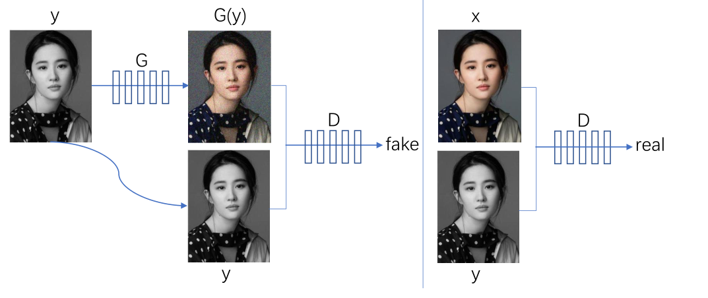

图9 cGAN结果示意图
  

​		pix2pix的插图：训练条件GANs映射灰度→颜色鉴别器学习在真实灰度、颜色元组和伪（由生成器合成）之间进行分类。与原始GANs不同，发生器和鉴别器都观察输入的灰度图像，pix2pix发生器没有噪声输入。

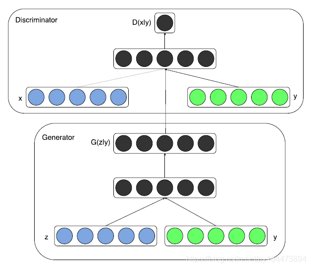

图10 生成器与判别器示意图
  

​		整个网络结构如上图所示，其中z为生成网络随机的输入，y为条件，x为真实样本。训练过程仍如GANs，先训练判别器，再训练生成器，交。替进行，直到判别器无法判定真实样本和生成的样本。训练过程中的不同在于，判别器D需要判别三种类型：

1. 条件和与条件相符的真实图片，期望输出为1；

2. 条件和与条件不符的真实图片，期望输出为0；

3. 条件和生成网络生成的输出，期望输出为0

   ​	在cGANs的论文中，进行了MNIST数据集的测试。在这个测试中，加入的条件为每个图片的标签。也就是生成器G的输入为随机向量和需要生成的图片的对应标签。判别器D的输入为真实图片和真实图片对应的标签、以及生成图片。下图为生成的一些图片

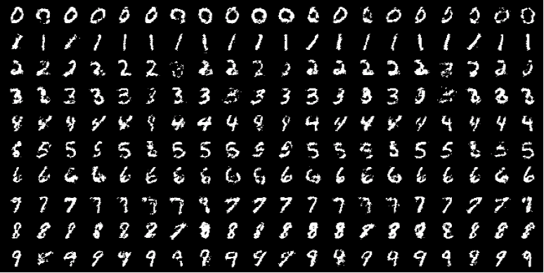

图11 cGAN生成结果示意图
  

​		在训练一个GAN时，只把0这个数字的图片作为真实样本放入GAN训练，GAN能生成一个数字的图片（比如0这个数字的图片），而要想生成0-9所有的对应图片，则需要训练10个不同的GAN，但是加入条件，也就是每个图片样本对应的标签的时候，我们就可以把10个数字的样本和对应的标签都同时放到这个网络中，就可以使用一个GAN网络生成0-9这十个数字的图片了

#### 4.1.3 CycleGAN

​		CycleGAN本质上是两个镜像对称的GAN，构成了一个环形网络。两个GAN共享两个生成器，并各自带一个判别器，即共有两个判别器和两个生成器。一个单向GAN两个loss，两个即共四个loss。

图12 循环一致性损失
  

论文里最终使用均方误差损失表示：

$$
{L_{LSGAN}}(G,{D_Y},X,Y) = {{\rm E}_{y \sim {p_{data}}(y)}}[{({D_Y}(y) - 1)^2}] + {{\rm E}_{x \sim {p_{data}}(x)}}[{(1 - {D_Y}(G(x)))^2}]
$$

CycleGAN的网络架构如图所示：

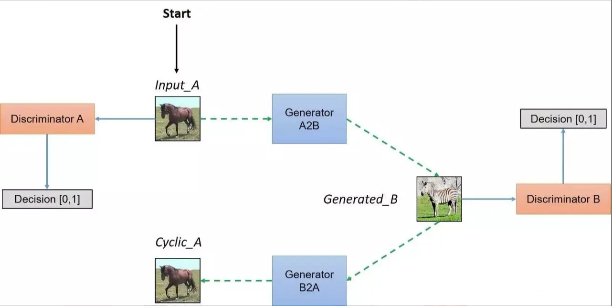

图13 CycleGAN结构示意图
  

​		可以实现无配对的两个图片集的训练是CycleGAN与Pixel2Pixel相比的一个典型优点。但是我们仍然需要通过训练创建这个映射来确保输入图像和生成图像间存在有意义的关联，即输入输出共享一些特征。

​		简而言之，该模型通过从域DA获取输入图像，该输入图像被传递到第一个生成器GeneratorA→B，其任务是将来自域DA的给定图像转换到目标域DB中的图像。然后这个新生成的图像被传递到另一个生成器GeneratorB→A，其任务是在原始域DA转换回图像CyclicA，这里可与自动编码器作对比。这个输出图像必须与原始输入图像相似，用来定义非配对数据集中原来不存在的有意义映射。

### 	4.2 GANs的训练策略

​		尽管理论上存在唯一的解决方案，但由于多种原因，GANs训练很困难，而且往往不稳定。一个困难是，GANs的最优权重对应于损失函数的鞍点，而不是极小值。具体模型训练可以参考[这里](https://paddlepedia.readthedocs.io/en/latest/tutorials/generative_adversarial_network/basic_concept/GAN%20train.html)。

​		有许多关于GANs训练的论文。Yadav等人用预测方法稳定了GANs。通过使用独立学习率，为鉴别器和生成器提出了两个时间尺度更新规则（TTUR），以确保模型能够收敛到稳定的局部纳什均衡。Arjovsky为充分理解GANs的训练做了很多理论上的研究，分析了GANs难以训练的原因，严格研究论证了训练中出现的饱和、不稳定等问题，研究了缓解这些问题的实际和理论基础方向，并引入了新的研究工具。Liang等人认为GANs训练是一个持续的学习问题。改进GANs训练的一种方法是评估训练中可能出现的经验性“症状”。这些症状包括：生成模型崩溃，为不同的输入生成非常相似的样本；鉴别器损耗迅速收敛到零，不向发生器提供梯度更新；模型收敛困难。

#### 4.2.1 基于输入输出改进的GAN模型

​		基于输入输出的改进主要是指从 G 的输入端和 D 的输出端进行改进。在 GAN 的基本模型中， G 的输入为隐空间上的随机变量，因此对其改进主要从隐空间与隐变量这两点展开。改进隐变量的目的是使其更好地控制生成样本的细节，而改进隐空间则是为了更好地区分不同的生成模式。 D 输出的判别结果是真假二分类，可以配合目标函数将其调整为多分类或去除神经网络的 Softmax 层直接输出特征向量，进而优化训练过程、实现半监督学习等效果。

​		BiCoGAN 模型的提出者认为MIRZA提出的模型的输入 z 与 c 相互纠缠，因此增加了一个编码器（记为 E ）用于学习从判别器输出到生成器两个输入的逆映射，从而更精确地编码 c ，以提升模型表现。如**图14**所示，将 z 与 c 的拼接（记为ˆ z）输入生成器得到输出G(ˆ z) ，将真实样本 x 输入编码器 得 到 输 出 E(x) ， 判 别 器 接 收G [(ˆz) ,ˆz]  或[x, E(x)], 作为输入，判定该输入来自生成器或为真实数据的某一类。由于真实样本 x 具有的标签可视为 c ，而 E(x)又可以被拆分为 z'与 c'，因此使 c 与 c'尽可能接近，也成为模型训练的目标，从而使编码器学习逆映射。文中提出使用 EFL（extrinsic factor loss）衡量两个分布 p c 与 p c' 的距离，并提出如式(6)所示的目标函数。

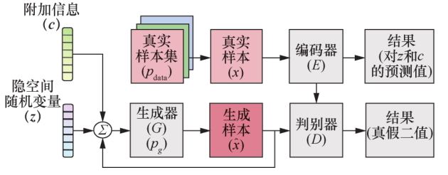

图14 BiCoGAN 模型
  

​		IcGAN （invertible conditional GAN）以MIRZA的模型为基础，增加了两个预训练的编码器 E z 和E y ，E z 用于生成隐空间中的随机变量 z，E y 用于生成原始条件 y，通过将 y 修改成 y'作为 cGAN的输入条件，从而控制合成图像的细节（如**图15**所示）。文章提出了 3 种从分布中进行采样获得y'的方法：当 y 为二进制向量时，可通过 KDE（kernel denisity estimation）拟合分布并进行采样；当 y 为实向量时，可选取训练集的标签向量进行直接插值；当某个条件并不是在所有训练集中表现唯一时，可直接对 p data 进行采样。

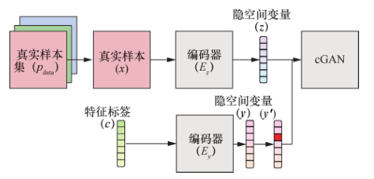

图15 IcGAN模型
  

​		DeLiGAN 适用于训练数据规模小、种类多的场景，DeliGAN 模型如**图16**所示。Gurumurthy等提出使用 GMM（Gaussian mixture model）对隐空间进行参数化，再随机选择一个高斯分量进行重参数化，从指定的高斯分布中获取样本，但模型使用 GMM 是一种简化假设，限制了其逼近更复杂分布的能力。

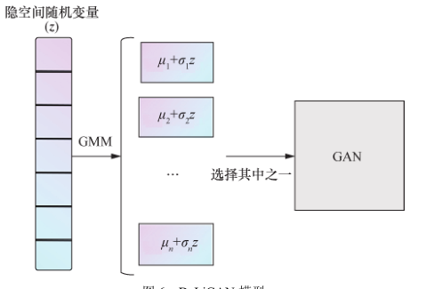

图16 DeLiGAN 模型
  

​		NEMGAN（noise engineered mode matchingGAN）的提出者提出一种能够在训练集存在数据不均衡情况下表现较好的模式匹配策略，根据生成样本训练出其在隐空间中的对应表示，得到潜在模式的先验分布，从而将生成样本的多种模式进行分离，并且与真实样本的模式进行匹配，保证了生成样本中包含多个真实样本的模式，以缓解模式崩溃问题。

​		FCGAN（fully conditional GAN）以MIRZA的模型为基础，将额外信息 c 连接到神经网络的每一层，一定限度上提升了有条件生成样本时的生成样本质量，但该模型在 c 较为复杂或大向量的场景中运算效率低。

​		SGAN（semi-supervised learning GAN） 是一种能够为数据集重建标签信息的半监督模型，其模型如**图17** 所示。它将 D 改进为分类器与判别器的结合体，D 的输出包含 N 类真实样本和一类生成样本，共有 N+1 类。向模型输入无标签的样本且判别器将其分类为真实样本时，可以将判别器的输出作为该样本的标签。

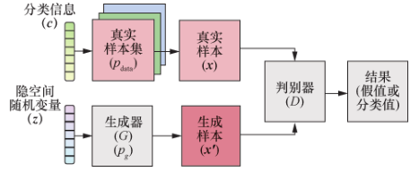

图17 SGAN 模型
  

​		AC-GAN（auxiliary classifier GAN）同时具备MIRZA的模型和ODENA的模型的特点，G 输入随机变量与分类信息 c，D 输出样本为假和分类概率，该方法能够在有条件生成样本时输出生成样本所属的类别。

#### 4.2.2 基于生成器改进的 GAN 模型

​		基于生成器进行改进的工作，旨在提高生成样本质量与避免模式崩溃问题，使模型能够生成多种类的样本，且同一种类内的样本具有多样性。改进的思路包括：使用集成学习（ensemble learning）的思想综合多个弱生成器所学习到的模式、设计每个生成器专注于学习特定模式多生成器架构，从而使模型整体包含多个模式，使用多智能体系统的思想使多个生成器之间产生竞争与合作的关系等。

​		AdaGAN模型的提出者提出了一种融入集成学习思想的迭代训练算法。在单步迭代过程中，根据训练样本与混合权值得到一个弱生成器，该弱生成器与上一轮迭代得到的弱生成器加权混合，得到本次迭代结果。若干轮迭代以后，生成器综合了多个弱生成器各自学习到的模式，缓解了模式缺失导致的模式崩溃问题，并能够生成出质量较好的样本。但是，混合多个生成器网络导致输入的隐空间不连续，不能像基本 GAN 模型那样通过插值法得到新的隐变量。

​		MADGAN（multi-agent diverse GAN）由多个生成器和一个判别器组成，其模型如图16所示。其中，判别器负责判断输入样本是真实样本还是生成样本，若为生成样本则判断它是由哪一个生成器所生成的。每个生成器专注于学习特定模式，模型使多个生成器各自学习，模型最终得到的生成样本来自多个学习到不同模式的生成器，显式地保证了生成样本的多样性，缓解了模式崩溃问题。

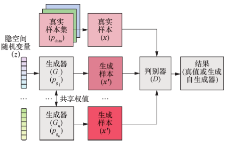

图18 MADGAN 模型
  

​		MGAN 缓解模式崩溃问题的思路与HOANG等人的思路类似，其模型如**图9**所示。该模型设计了一种与判别器权值共享但去除掉 Softmax 层的分类器，用于承担判断生成样本所属生成器的功能，判别器仅负责判别样本为真实样本还是生成样本。

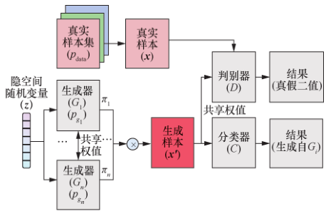

图19 MGAN 模型
  

​		MPMGAN（message passing multi-agent GAN）模型是一种引入消息传递机制的多生成器，生成器输出作为传递给其他生成器的消息。在消息共享机制的作用下，所有生成器都有合作目标、竞争目标两种目标。合作目标鼓励其他生成器的生成样本优于自身的生成样本；竞争目标促使自身的生成样本优于其他生成器的生成样本。两种目标共同作用使生成样本质量得以优化。

图20 MPMGAN 模型
  

#### 4.2.3 基于判别器改进的GAN模型

​		GAN 模型训练过程中，最初的生成样本质量较差，判别器可以简单地区分样本，这导致生成器初始训练速度慢。改进判别器，使其符合生成器当前能力有助于加快训练，使其识别多种模式可以缓解模式崩溃问题。改进思路包括使单一判别器能识别出更多模式，以及使多个判别器中的每个判别器专注于识别特定模式等。

​		PacGAN 模型如**图21**所示。PacGAN 将同一类的多个样本“打包”后一起输入判别器，以此保证每次判别器输入的样本都具有多样性。由于判别器每次接受输入时都能感知到样本的多样性，生成器试图欺骗判别器时，需要保证生成样本的多样性，这有助于缓解模式崩溃问题。

图21 PacGAN模型
  

​		GMAN （ generative multi-adversarial net-works）模型的提出者认为过度改进判别器会使目标函数过于苛刻，反而抑制生成器学习，因此提出一种结合集成学习的方法，通过设置多个判别器，生成器从多判别器聚合结果中学习，从而使网络加速收敛。GMAN 模型如**图22**所示。

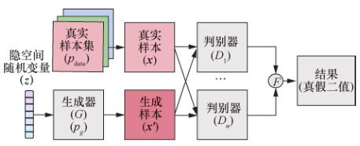

图22 GMAN模型
  

​		DropoutGAN设置了一组判别器，在每批样本训练结束时，以一定概率删除该结果，将剩余结果聚合后反馈到生成器，以此使生成器不局限于欺骗特定判别器。DropoutGAN 模型的提出者认为模式崩溃问题是生成器对特定判别器或静态集成判别器的过度拟合，即生成器学习到了使判别器输出真值的特殊条件而非学习到了样本模式，而该模型的结构中，判别器集合是动态变化的，生成器无法学习到欺骗判别器的特殊条件，从而使生成器学习多种样本模式，有助于缓解模式崩溃问题。DropoutGAN 模型如**图23**所示。

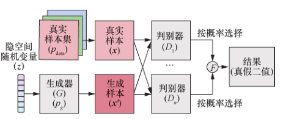

图23 DropoutGAN模型
  

​		D2GAN（dual discriminator GAN）设置了两个判别器 D 1 、D 2 ，分别使用正向 KL 散度及逆向 KL 散度，以充分利用二者互补的统计特性。其中 D 1 通过正确判定样本来自真实样本分布获得奖励，D 2 则通过正确判定样本来自生成样本分布获得奖励。生成器同时欺骗两个判别器，以此来提升生成样本的质量。D2GAN 模型如**图24**所示。

图24 D2GAN模型
  

​		StabilizingGAN 模型的提出者认为真实样本在空间中集中分布，而生成样本初始时在空间中分散分布，导致训练初期判别器能够准确判断出几乎所有生成样本，产生无效梯度，使生成器训练缓慢。因此，他们提出同时训练一组视角受限的判别器，每个判别器都专注于空间中的一部分投影，生成器逐渐满足所有判别器的限制，以此稳定训练，提升生成样本质量。

​		在 EBGAN（energy-based GAN）模型（如**图25**所示）中引入了能量函数的方法，事物间差异越大能量越高，故而真实分布附近样本具有较低能量。其研究者设计了一个由编码器和解码器构成的判别器，使用 MSE（mean square error）衡量生成样本与真实样本的差异并作为能量函数，生成器目标为生成最小化能量的生成样本。BEGAN（boundary equilibrium GAN）使用自编码器替代ZHAO等人提出来的模型中的判别器。

图25 EBGAN模型
  

#### 4.2.4 基于多模块组合改进的 GAN 模型

​		除了更好地拟合真实样本分布之外，提升网络收敛的速度、提高生成图片的清晰度、将其应用在半监督学习上等同样是 GAN 模型改进的方向。这类研究工作通过调整模块结构，对不同的影响因素加以优化处理，使模型达到特定目的。

​		GRAN（ generative recurrent adversarialnetworks）是一种递归生成模型，它反复生成以上一状态为条件的输出，最终得到更符合人类直觉的生成样本。

​		StackGAN 以MIRZA的模型为基础构建了一种两阶段模型（如**图26**所示）。它将文本描述作为额外信息，阶段一生成较低分辨率的图像并输出至阶段二，阶段二输出较高分辨率的图像，从而提高生成图像的分辨率。

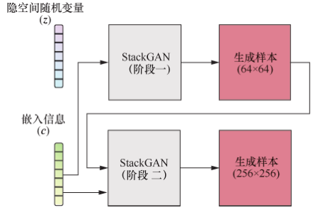

图26 StackGAN模型
  

​		ProgressGAN 模型的提出者认为小尺度图像能够保证多样性且细节不丢失，他们使用多个且逐渐增大的 WGAN-GP 网络，逐步训练最终生成高清图像。

​		TripleGAN 通过增加一个分类器网络为真实样本生成标签，生成器为真实标签生成样本，判别器判别接收的样本标签对是否为有真实标签的真实样本，从而同时训练出效果较好的分类器和生成器，将 GAN 的能力扩展到可以为无标签样本打标签。TripleGAN 模型如**图 27**所示。

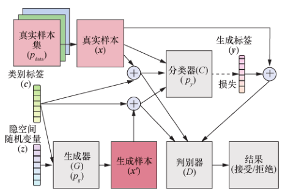

图27 TripleGAN模型
  

​		ControlGAN 模型的提出者认为MIRZA的模型中的判别器同时承担了真实样本分类与判别真假样本两个任务，因此将其拆分为独立的分类器和判别器，从而在有条件生成样本时更细粒度地控制生成样本的特征。ControlGAN 模型如**图28**所示。

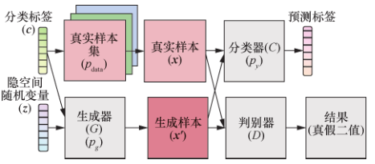

图28 ControlGAN模型
  

​		SGAN（several local pairs GAN）使用若干组局部网络对和一组全局网络对，每组网络对有一个生成器与一个判别器。局部网络对使用固定的配对网络进行训练，不同局部网络对之间没有信息交互，全局网络利用局部网络进行训练。由于每一个局部网络对都可以学到一种模式，在使用局部网络对更新全局网络对后，能够保证全局网络对综合了多种模式，从而缓解模式崩溃问题。SGAN 模型如**图29**所示。

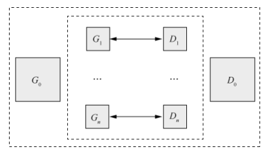

图29 SGAN模型
  

​		MemoryGAN 模型的提出者认为隐空间具有连续的分布，但不同种类的结构却具有不连续性，因此在网络中加入存储网络供生成器和判别器访问，使生成器和判别器学习数据的聚类分布以优化该问题。

#### 4.2.5 基于模型交叉思想改进的GAN模型

​		结合其他生成模型思想及其他领域思想对GAN 模型进行改进，同样可以起到优化模型表现或拓展模型应用场景的效果。

​		DCGAN 使 用 去 除 池 化 层 的 CNN（convolutional neural network）替代基本 GAN 模型中的多层感知机（如**图 30**所示），并使用全局池化层替代全连接层以减少计算量，以提高生成样本的质量，优化训练不稳定的问题。

图30 DCGAN模型中的CNN
  

​		CapsuleGAN 使用胶囊网络作为判别器的框架（如**图31**所示）。胶囊网络可以用于替代神经元，将节点输出由一个值转变为一个向量，神经元用于检测某个特定模式，而胶囊网络可以检测某个种类的模式，以此提高判别器的泛化能力，从而提高生成样本质量。

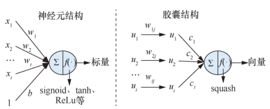

图31 CapsuleGAN的基本原理
  

​		VAEGAN 利用GAN来提高VAE生成样本的质量。其观点是：在 VAE 中，编码器将真实分布编码到隐空间，而解码器将隐空间恢复为真实分布。单独解码器即可用作生成模型，但生成样本质量较差，因此再将其输入判别器中。

​		DEGAN（decoder-encoder GAN）模型的提出者认为输入的随机变量服从高斯分布，因此生成器需将整个高斯分布映射到图像，无法反映真实样本分布。因此借鉴 VAE 的思想，在 GAN中加入预训练的编码器与解码器，将随机变量映射为含有真实样本分布信息的变量，再传递给GAN，从而加速收敛并提高生成质量。

​		AAE（adversarial auto-encoder）通过在 AE（auto-encoder）的隐藏层中增加对抗的思想来结合 AE 与 GAN。判别器通过判断数据是来自隐藏层还是真实样本，使编码器的分布向真实样本分布靠近。

​		BiGAN 使用编码器来提取真实样本特征，使用解码器来模仿生成器，并使用判别器来辨别特征样本对来自编码器还是解码器，最终使编码方式和解码方式趋近于互逆，从而使随机变量与真实数据形成映射。ALi和 BiGAN 本质相同，二者仅有细微区别。BiGAN 模型如**图32**所示。

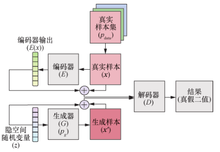

图32 BiGAN模型
  

​		MatAN（matching adversarial network）使用孪生网络替换判别器，以将正确标签考虑在生成器目标函数中。孪生网络用于衡量真实数据与生成数据的相似度。该方法对加快生成器训练有效。

​		SAGAN（self-attention GAN）模型的提出者认为 GAN 在合成结构约束少的种类上表现较好，但难以捕捉复杂的模式，通过在网络中引入自注意力机制以解决该问题。

​		KDGAN 运用 KD（knowledge distillation）的思想，模型包含作为学生网络的轻量分类器、大型复杂教师网络及判别器，其中，分类器和教师网络都生成标签，二者通过互相蒸馏输出学习彼此的知识，最终可训练得到表现较好的轻量级分类器。

​		IRGAN 利用 GAN 将 IR（information re-trieval）领域中的生成式检索模型与判别式检索模型相结合，对于生成器采用基于策略梯度的强化学习来训练，从而在典型的信息检索任务中取得较好的表现。IRGAN 模型如**图33**所示。

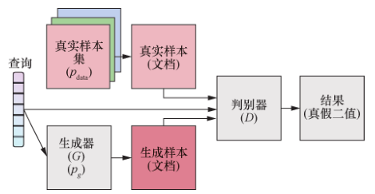

图33 IRGAN模型
  

​		LapGAN使用了图像处理领域的思想，同时使用三组 cGAN ，按照高斯金字塔的模式对图像逐级下采样训练网络，按照拉普拉斯金字塔的模式对图像逐级上采样，从而达到从模糊图像中重构高像素图像的目的。

​		QuGAN 将 GAN的思想与量子计算的思想相结合，将生成器类比生成线路，判别器类比判别线路，生成线路尽可能模仿真实线路的波函数，判别线路尽可能仅通过对辅助比特的测量来确定输入的波函数来自生成线路还是真实线路。

​		BayesianGAN 模型的提出者认为 GAN 隐式学习分布的方法难以显式建模，因此提出使用随机梯度哈密顿蒙特卡洛方法来边际化两个神经网络的权值，从而使数据表示具有可解释性。

## 5、GAN的应用

​		GANs是一个强大的生成模型，它可以使用随机向量生成逼真的样本。我们既不需要知道明确的真实数据分布，也不需要任何数学假设。这些优点使得GANs被广泛应用于图像处理、计算机视觉、序列数据等领域。上图是基于GANs的实际应用场景对不同GAN进行了分类，包括图像超分辨率、图像合成与处理、纹理合成、目标检测、视频合成、音频合成、多模态转变等。

### 5.1 计算机视觉与图像处理

​		GANs最成功的应用是图像处理和计算机视觉，如图像超分辨率、图像合成和处理以及视频处理。

#### 5.1.1 超分辨率（SR）

​		图像超分辨率技术主要解决将低分辨率的图像在不失真的前提下转变为高分辨率的问题，且需要在准确性和速度斱面保持优越性能，此外超分辨率技术可解决例如医学诊断、视频监控、卫星遥感等场景的部分行业痛点问题，应用此技术产生的社会实际价值不可估量。基于深度学习的图像超分辨技术可分为：有监督、无监督、特定应用领域三种类型。SR-GAN 模型将参数化的残差网络代替生成器，而判别器则选用了 VGG 网络，其损失函数通过内容损失和对抗损失的加权组合，相比其他深度卷积网络等模型在超分辨精度和速度上得到了改进，将图像纹理细节的学习表征较好，故而在超分辨领域取得了不俗的效果。

#### 5.1.2 图像合成与处理

##### 人脸

- 姿势相关：提出了用于姿势不变人脸识别的解纠缠表示学习GAN（DR-GAN）。Huang等人通过同时感知局部细节和全局结构，提出了一种用于照片级真实感正面视图合成的双通路GAN（TP-GAN）。Ma等人提出了一种新颖的姿势引导人物生成网络（PG2），该网络基于新颖的姿势和人物的图像，合成任意姿势下的人物图像。Cao等人提出了一种高保真姿态不变模型，用于基于GANs的高分辨率人脸前方化。Siarohin等人提出了用于基于姿势的人体图像生成的可变形人体器官。提出了用于定制化妆转移的姿态鲁棒性SpatialWare  GAN（PSGAN）。
- 肖像相关：APDrawingGAN建议从具有层次性Gan的人脸照片生成艺术肖像画。APDrawingGAN有一个基于微信的软件。GANs还用于其他与人脸相关的应用，如人脸属性更改和肖像编辑。
- 人脸生成：GANs生成的人脸质量逐年提高，这可以在Sebastian  Nowozin的GAN讲座材料1中找到。基于原始GANs生成的人脸视觉质量较低，只能作为概念证明。Radford等人使用了更好的神经网络结构：用于生成人脸的深度卷积神经网络。Roth等人解决了GAN训练的不稳定性问题，允许使用更大的架构，如ResNet。Karras等人利用多尺度训练，以高保真度生成百万像素的人脸图像。面生成的每个对象都是一张脸，且大多数脸数据集往往由直视摄像机的人组成，因此比较简单。

##### 一般目标

​		让GAN处理像ImageNet这样的分类数据集有点困难，因为ImageNet有一千个不同的对象类，并且这些图像的质量逐年提高。

​		虽然大多数论文使用GANs合成二维图像，但Wu等人使用GANs和体积卷积合成了三维（3-D）样本。Wu等人合成了汽车、椅子、沙发和桌子等新奇物品。Im等人利用反复出现的敌对网络生成图像。Yang等人提出了用于图像生成的分层递归GAN（LR-GAN）。

##### 图像修复

​		图像补全是一种传统的图像修复处理仸务，其目的是填补图像中内容缺失或被遮盖的部分，在目前的生产生活环境中此类仸务得到广泛的现实应用。大多数补全方法都是基于低级线索，仍图像的邻近区域中寻找小块，幵创建与小块相似的合成内容。王海涌等人借助此原理，实现了局部遮挡情况下的人脸表情识别，识别效率较高。与现有的寻找补全块迚行合成的模型不同，相关研究文献提出的模型基于 CNN 生成缺失区域的内容。该算法采用重构损失函数、两个对抗性损失函数和一个语义解析损失函数迚行训练，以保证像素质量和局部-全局内容的稳定性。

##### 人与图像生成过程之间的交互

​		有许多应用程序涉及人与图像生成过程之间的交互。真实图像操作很困难，因为它需要以用户控制的方式修改图像，同时使其看起来真实。如果用户没有有效的艺术技巧，编辑时很容易偏离自然图像的多样性。交互式GAN（IGAN）定义了一类图像编辑操作，并将其输出约束为始终位于学习的流形上。

#### 5.1.3 纹理合成

​		纹理合成是图像领域的经典问题。Markovian  GANs（MGAN）是一种基于GANs的纹理合成方法。通过捕获马尔可夫面片的纹理数据，MGAN可以快速生成风格化的视频和图像，从而实现实时纹理合成。空间GAN（SGAN）是第一个将GAN与完全无监督学习应用于纹理合成的人。周期性空间GAN（PSGAN）是SGAN的一个变体，它可以从单个图像或复杂的大数据集中学习周期性纹理。

#### 5.1.4 目标检测

​		我们如何学习对变形和遮挡保持不变的对象检测器？一种方法是使用数据驱动策略——收集在不同条件下具有对象示例的大规模数据集。我们希望最终的分类器能够使用这些实例来学习不变性。是否可以查看数据集中的所有变形和遮挡？一些变形和遮挡非常罕见，在实际应用中几乎不会发生；然而，我们想学习一种对这种情况不变的方法。Wang等人使用GANs生成具有变形和遮挡的实例。对手的目标是生成对象检测器难以分类的实例。通过使用切割器和GANs，Segan检测到图像中被其他对象遮挡的对象。为了解决小目标检测问题，Li等人提出了感知GAN，Bai等人提出了端到端多任务GAN（MTGAN）。

#### 5.1.5 视频

​		Villegas等人提出了一种深度神经网络，用于使用GANs预测自然视频序列中的未来帧。Denton和Birodkar提出了一个新模型，名为解纠缠表示网（DRNET），该模型基于GANs从视频中学习解纠缠图像表示。相关研究文献提出了一种新的生成性对抗学习框架下的视频到视频合成方法（video2video）。MoCoGan建议分解运动和内容以生成视频。GAN还被用于其他视频应用，如视频预测和视频重定目标。

​		视频可通过逐帧分解理解为多张图片的组合，故而在 GAN 生成图像的基础上，实现视频的生成和预测 。视频一般而言是由相对静止的背景色和动态的物体运动组成的，VGAN考虑了这一点，使用双流生成器以 3D CNN 的移动前景生成器预测下一帧，而使用 2D CNN 的静态背景生成器使背景保持静止。Pose-GAN采用混合VAE和GAN斱法，它使用 VAE 斱法在当前的物体姿态和过去姿态隐藏的表示来估计未来的物体运动。

​		基于视频的 GAN 不仅需要考虑空间建模，还需要考虑时间建模，即视频序列中每个相邻帧之间的运动。MoCoGAN被提出以无监督的斱式学习运动和内容，它将图像的潜在空间划分为内容空间和运动空间。DVD-GAN能够基于 BigGAN 架构生成更长、更高分辨率的视频，同时引入可扩展的、视频专用的生成器和鉴别器架构。

#### 5.1.6 其他图像和视觉应用

​		GANs已被用于其他图像处理和计算机视觉任务，如对象变形、语义分割、视觉显著性预测、对象跟踪、图像去杂、自然图像抠图、图像修复、图像融合，图像完成，图像分类。

### 5.2 时序数据

​		GANs在自然语言、音乐、语音、语音和时间序列等顺序数据方面也取得了成就。

#### 5.2.1 自然语言处理

​		GAN 在图像上的性能表现，让众多研究者在文本生成领域也提出了基于 GAN 的一些模型。SeqGAN 与强化学习结合，避免了一般 GAN 模型不能生成离散序列，且可在生成离散数据时能够返回模型的梯度值，此类斱法可用于生成语音数据、机器翻译等场景。MaskGAN模型，引入了 Actor-Critic 架构可根据上下文内容填补缺失的文本信息。

​		除了图像生成文本的应用，文献 StackGAN 可实现通过输入文本信息来产生相应的文本所描述的图像且图像具有高分辨率，此模型实现了文本与图像的交互生成。此外 CookGAN 从图像因果链的角度实现了基于文本生成图像菜单的方法。而TiVGAN 则实现了通过文本来产生连续性视频序列的构想。

#### 5.2.2 音乐

​		GANs被用于生成音乐，如连续RNN-GAN（C-RNN-GAN）、连续RNN-GAN（风琴）和SeqGAN。

#### 5.2.3 语音和音频

​		GANs已用于语音和音频分析，如合成、增强和识别。

### 5.3 其他应用

#### 5.3.1 医学领域

​		一般来说，在医学成像中使用 GANs 有两种方法：第一种集中在生成阶段，这有助于实现训练数据的基本结构，以创建真实的图像，使得 GANs 能够 更 好 地 处 理 数 据 稀 缺 性 和 患 者 隐 私 问 题。第二种集中在判别阶段，其中判别器可以被认为是未处理图像的先验学习，因此可以作为伪生成图像的检测器。

​		生成阶段：Sandfort 等人提出了一种基于CycleGAN 的数据增强模型，以提高 CT 分割中的泛化性。Han 等人提出了一种基于 GAN 的两阶段无监督异常检测 MRI 扫描斱法。

​		判别阶段：Tang 等人提出了一种基于叠加生成对抗网络的 CT 图像分割斱法，网络第一层减少CT 图像中的噪声，第二层创建具有增强边界的更高分辨率图像。Dou 等人提出了用于 MRI 和 CT 的 GANs，通过以无监督斱式支持源域和目标域的特征空间来处理高效的域转移。

#### 5.3.2 三维重构

​		GAN 在三维空间上对物体的立体形状补全或重构，是对三维重构技术的完善和扩展。Wang 等人提出了一种混合结构，使用递归卷积网络(LRCN)的3D-ED-GAN 模型。Wu 等人提出了 3D-VAE-GAN 模型，该模型利用体积卷积网络和生成对抗网络最新的研究理论仍概率空间生成 3D 对象。相关研究文献介绍了一种新的GAN 训练模型来实现物体详细的三维形状。该模型采用带梯度惩罚的 Wasserstein 归一化训练，提高了图像的真实感，这种架构甚至可以仍 2D 图像中重建3D 形状并完成形状补全。

图34 现实世界物品扫描的 3D 
  

​		 3D-RecGAN 是一个随机深度视图重建指定对象的完整三维结构。该模型在GAN 结构上是一种编码器-解码器 3D 深度神经网络，结合了两个目标损失：用于 3D 物体重建的损失和改迚的 Wasserstein GAN 损失。也有人做出了用于语义部件编辑、形状类比和形状揑值以及三维物体形状补全的代数操作和深度自动编码器 GAN (AE-EMD)。

#### 5.3.3 数据科学

​		GANs已用于数据生成、神经网络生成、数据增强、空间表示学习、网络嵌入、异构信息网络和移动用户评测。

​		GANs已经广泛应用于许多其他领域，如恶意软件检测、国际象棋游戏、隐写术、隐私保护、社交机器人和网络修剪。

## 6、常用数据集

​		一般来说，基于图像的GANs方法使用的数据集，是基于现有数据图像基础上进行上（下）采样，增加干扰处理。处理后的图像与原图像作为一对图像用于GANs网络的训练。其他方面如视频、文字等，也是在已有的开源（或闭源）数据集上经过预处理后，讲原始数据作为标签进行网络的训练。不过，这样制作的数据集始终不能完全代表实际情况。下面讲介绍五个用于训练GANs的数据集。

### 6.1 [抽象艺术数据集](https://www.kaggle.com/bryanb/abstract-art-gallery)

​		此数据集包含从 wikiart.org 刮出的 2782 张抽象艺术图像。这些数据可用于构建 GAN，以生成抽象艺术的合成图像。数据集包含梵高、大理、毕加索等真实抽象艺术的图像。

### 6.2 [与 C. 埃莱根斯的高内容筛选](https://www.kaggle.com/kmader/high-content-screening-celegans)

​		这些数据包含与屏幕对应的图像，以找到使用圆虫C.埃莱甘斯的新抗生素。数据有圆虫感染一种叫做*肠球菌的*病原体的图像。有些图像是未用抗生素治疗的圆虫，安皮林，而另一些图像是受感染的圆虫，已经用安培素治疗。对于那些有兴趣将GAN应用于一个有趣的药物发现问题的人来说，这是一个很好的开始！

### 6.3 [肺胸X光异常](https://www.kaggle.com/kmader/pulmonary-chest-xray-abnormalities/home)

​		此数据集包含由放射科医生临床标记的胸部 X 射线图像。有336张胸部X光图像与结核病和326张图像对应健康人。对于那些有兴趣使用 GAN 进行医疗图像数据合成的人来说，这是一个很好的数据源。

### 6.4 [假脸](https://www.kaggle.com/hyperclaw79/fakefaces)

​		这些数据实际上包含由 GAN 生成的人类面孔的合成图像。这些图像是从网站这个人不存在获得的。该网站生成一个新的假脸图像，由GAN制作，每次你刷新页面。这是一组伟大的数据，从生成合成图像与 GAN 开始。

### 6.5 [眼镜或没有眼镜](https://www.kaggle.com/jeffheaton/glasses-or-no-glasses)

​		此数据集包含带眼镜的面部图像和无眼镜的面部图像。虽然这些图像是使用 GAN 生成的，但它们也可以作为生成其他合成图像的训练数据。

## 7、前沿问题

​		由于GAN在整个深度学习领域都很流行，其局限性最近得到了改进。对于GANs来说，仍然存在一些有待解决的研究问题。

### 7.1 模式崩溃问题

​		尽管现有研究在解决模式崩溃问题上进行了很多尝试，也取得了一些进展，但如何解决模式崩溃问题依然是 GAN 面临的主要挑战。可以尝试的[解决办法](https://paddlepedia.readthedocs.io/en/latest/tutorials/generative_adversarial_network/basic_concept/Collapse.html)。

​		针对 GAN 发生模式崩溃的原因，已有一些研究工作尝试给予解释：将生成器视为一个 N 维流形的参数化描述，当流形上某点的切线空间维数小于 N ，导致在该点沿一些方向进行变化时，数据的变化无效，因此生成器会产生单一的数据； 基于最优传输理论，认为生成器将隐空间的分布映射为流形上的分布是一个传输映射，它具有间断点，是非连续映射，但神经网络目前仅能近似连续映射，从而导致生成无意义结果并引发模式崩溃；当模式崩溃发生时，判别器网络权值矩阵的奇异值急剧减小，可从该问题入手解决模式崩溃问题。

​		与普通神经网络训练过程相比， GAN 模型中存在生成器 G 与判别器 D 之间的博弈机制，这使得 GAN 模式崩溃问题变得复杂。总而言之， GAN模式崩溃问题研究工作尚处于起步阶段，研究出发的角度多样，未形成一个统一的框架来解释该问题。今后的工作如果能从 GAN 的博弈机制出发，将生成器和判别器两方面的相关因素综合起来，会有助于该问题的解决。

### 7.2 训练集样本的影响

​		神经网络的表现主要取决于模型自身的特点，以及训练使用的真实样本集。同样， GAN模型的训练学习的质量也受制于训练样本集的影响。一方面，样本集的自身内在数据分布情况可能会影响 GAN 的训练效率和生成质量。例如，在样本集上定义类内距离集与类间距离集，并依此提出基于距离的可分性指数，用于量化样本可分性，并指出当不同种类样本按相同分布混合时最难以区分，使用这种样本集进行有监督学习时很难使模型有较好表现。这对于 GAN的样本生成质量评价指标设计具有借鉴意义。另一方面， GAN 模型的一大特点是学习真实样本分布，因此需要足够多真实样本进行训练才能有较好表现，研究如何使用小规模训练集得到较好的 GAN 模型是具有挑战和意义的。 GAN 模型对训练集质量也有较高要求，而高质量的数据集往往难以获得，因此研究哪些数据会影响模型表现，如何规避低质量样本带来的负面影响，以降低对训练集质量的高要求，成为今后的研究方向。

​		此外，在降低训练集样本数量需求方面已有一些研究。通过迁移学习，在预训练的生成器网络和判别器网络上使用适当的样本进行微调，但样本严重不足或样本与预训练数据区别较大时效果不佳。有研究者认为网络权值的奇异值与生成样本的语义有关，因此通过对网络权值进行奇异值分解，微调预训练模型的奇异值来达到使用较少样本训练的目的。在 GAN 上使用元学习，在小样本训练问题上取得了一定的效果。使用重建损失和三元组损失改造GAN 的损失函数，从而将自监督学习的思想引入GAN 中，在小样本训练问题上取得了一些效果。

​		对于降低训练集样本质量需求的研究已有一些研究。 NRGAN 在模型中设置了图像生成器和噪声生成器，分别用以学习真实样本中的数据分布和噪声分布，从而在无须预知噪声分布的情况下从有噪训练集中生成无噪样本。

​		目前，有关训练集样本对 GAN 的影响的研究仍处于初期，缩小训练集规模往往导致对复杂模式支持较差，而降低训练集样本质量需求则伴随着过多假设。后续工作应进一步研究产生这些限制的原因，并以此为指导使其应用场景更符合真实情况。

### 7.3 与模型鲁棒性问题研究的交叉

​		神经网络鲁棒性反映当输入数据集上出现微小扰动后，模型依然能在输出端表现出抗干扰的能力。 GAN 的研究与人工神经网络鲁棒性的研究相辅相成，密切相关。一方面， GAN 使用对抗样本对网络模型进行训练，有助于提升模型的鲁棒性  。另一方面，神经网络鲁棒性的相关研究与 GAN 的改进存在内在联系，如深度神经网络经过对抗训练后损失在峰值附近更加平滑，以及在 CNN 中使用 Lipschitz 条件可以使模型同时具有较好的鲁棒性与准确性，该领域的相关研究对于 GAN 的改进有一定的参考借鉴价值，特别是在生成对抗样本质量的评价和生成器的目标研究方面。

​		有研究者从对抗频度和对抗严重程度两方面描述神经网络在数据集上的鲁棒性。其中对抗频度反映数据集上对抗性扰动发生的可能性，对抗严重程度反映扰动发生时导致输出偏离的程度。该方法在 GAN 生成对抗样本数据集质量的评价层面具有借鉴价值，并对生成器的训练具有指导意义。另有研究者提出一种基于符号线性松弛的神经网络安全性分析方法，把对抗性扰动当作安全属性违反的一种约束特例来处理，其框架可以定义 5 种不同的安全属性约束，针对对抗性扰动的结果进行细化。这些工作有助于 GAN 生成器设计目标的分类研究。

## 8、总结

​		本文从不同方面综述了对抗生成网络（GANs）的现有模型方法。首先根据训练策略、结构变化、训练技巧、监督类型等方面对现有GAN方法进行了分类，并以经典网络为例，分别介绍了不同GAN网络的改进点。接着详细介绍了GAN网络的基本结构，并给出了较新的生成对抗网络发展脉络。最后基于实际应用场景对经典常用的GAN模型进行了介绍。我们选取了Kaggle的五个常用的GAN数据集，并分别进行了介绍。数据集链接分别放置于数据集名称处。最后，针对现阶段的生成对抗网络前沿问题进行了介绍。

## 参考文献

[1] [GAN网络及变体整理](https://blog.csdn.net/u010138055/article/details/94441812)

[2] [A review on generative adversarial networks: Algorithms, theory, and applications](https://arxiv.org/abs/2001.06937)

[3] [Generative adversarial networks: An overview](https://ieeexplore.ieee.org/abstract/document/8253599/)

[4] [Generative Adversarial Networks (GANs) in networking: A comprehensive survey & evaluation](https://www.sciencedirect.com/science/article/pii/S1389128621002139)

[5]  [生成对抗网络及其应用研究综述](https://kns.cnki.net/kcms/detail/11.2127.TP.20210720.1804.015.html)

[6] [生成对抗网络研究综述](http://www.infocomm-journal.com/cjnis/CN/10.11959/j.issn.2096-109x.2021080)

